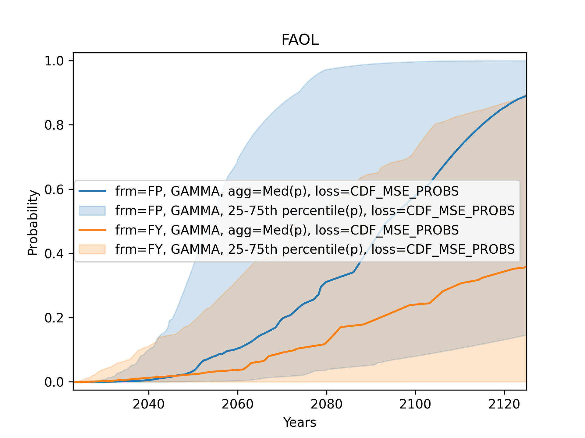

This repository contains code and data for the analysis of the Expert Survey on Progress in AI (ESPAI). Currently, only analyses related to the timing of progress are implemented.

# Usage
High-level functions usually take the following enums to configure the analysis: 

| Enum           | Description                                     | Members                                                  |
| -------------- | ----------------------------------------------- | -------------------------------------------------------- |
| `Question`     | What were respondents asked to forecast?        | `Question.HLMI`, `Question.FAOL`, `Question.TRUCK_DRIVER`, and many others representing various AI capabilities and occupations |
| `Framing`      | Fixed-years or fixed-probabilities framing      | `Framing.FY`, `Framing.FP`                               |
| `DistFamily`   | Distribution family used to fit responses       | `DistFamily.GAMMA`, `DistFamily.WEIBULL`, `DistFamily.GEN_GAMMA`, `DistFamily.cinterp5`, `DistFamily.cinterp3` |
| `LossFunction` | Loss function used in distribution fitting      | `LossFunction.CDF_MSE_PROBS`, `LossFunction.CDF_MSE_YEARS`, `LossFunction.LOG_LOSS` |
| `AggMethod`    | Method for aggregating individual distributions | `AggMethod.ARITH_MEAN_PROBS`, `AggMethod.MEDIAN_PROBS`, `AggMethod.GEO_MEAN_ODDS`, `AggMethod.GEO_MEAN_ODDS_WINSORIZED`, `AggMethod.ARITH_MEAN_YEARS` |

## Plots
Some plotting functions are a provided in `analyses.py`. For example, to quickly compare different configurations for the same question:

```python
import matplotlib.pyplot as plt

from espai import Question, Framing
from espai.aggregate import AggMethod
from espai.analyses import compare_configurations
from espai.config import Config
from espai.fit import DistFamily, LossFunction

configs = [
    Config(
        framing=Framing.FP,
        family=DistFamily.GAMMA,
        loss_function=LossFunction.CDF_MSE_PROBS,
        aggregation=AggMethod.MEDIAN_PROBS,
    ),
    Config(
        framing=Framing.FY,
        family=DistFamily.GAMMA,
        loss_function=LossFunction.CDF_MSE_PROBS,
        aggregation=AggMethod.MEDIAN_PROBS,
    ),
]

fig, ax = plt.subplots()
compare_configurations(configs, Question.FAOL, ax)
fig.show()
```
This will produce the following plot:

